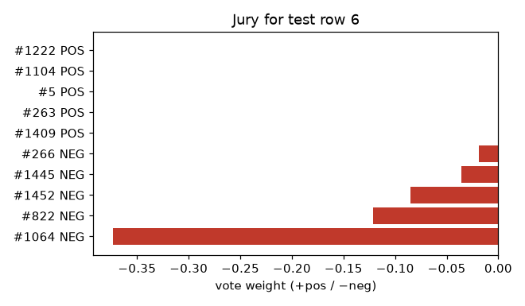
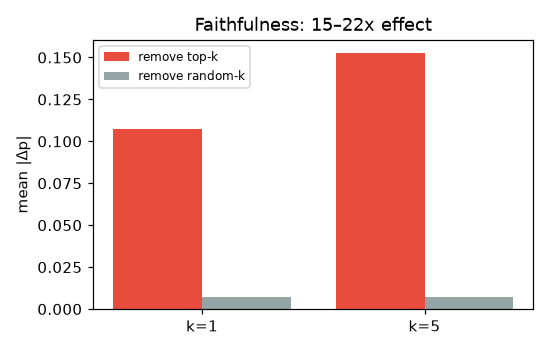
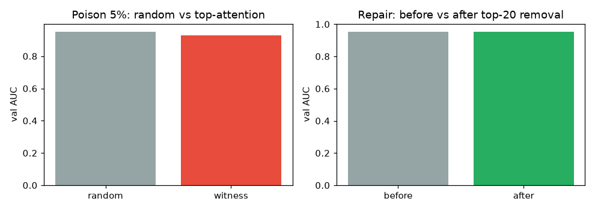

# PFN Witness — who convinced TabPFN?

> **Why this matters (20s):** TabPFN predicts by voting over training rows —
> Witness shows the votes. Removing top witnesses moves predictions 15–22×
> more than random removal, and an audit score finds harmful rows (repair
> +0.004 over random removal). Provenance you can act on, not post-hoc guess.

TabPFN-3.5's decoder is an attention retrieval head: each prediction is a
vote over training rows. Witness exposes the votes (via
`tabpfn-extensions`' decoder readout, Aug 2026) and turns them into:

- **Jury**: supporting/opposing training rows per prediction, with values.
- **Audit**: H score = attention received while voting against truth.
- **Faithfulness**: removing top-k witnesses moves predictions more than
  random removal (measured, not assumed).
## Evidence (`figs/witness.csv`, phoneme)

- **Faithfulness**: removing top-1 witness moves P by 0.107 vs 0.007 random
  (15×); top-5: 0.153 vs 0.007 (22×). Decoder votes are mechanistically
  prediction-relevant: removing high-weight witnesses moves predictions far
  more than removing random rows.




- **Poison**: corrupting top-attention 5% → AUC 0.9285 vs random-5% 0.9522.
- **Repair**: audit-H top-20 removal → 0.9511 → 0.9536 on 5%-flipped labels;
  control rerun: top-20-H 0.9558 vs 3× random-20 0.9516–0.9517
  (`figs/repair_ctrl.csv`). The audit finds harmful rows, not just any rows.



Not claimed: first data valuation for TabPFN (LOO/Shapley work exists).
Claimed: prediction-local provenance from decoder weights, aggregated into
a label-audit and repair loop.

## Reproduce

Fresh-env verified 2026-09-22 (clean venv, `pip install -e .`, witness suite 2 passed in 18s CPU; TabPFN weights from public HF, no keys).

```bash
pip install -e .   # Python 3.10+, torch, tabpfn==9.0.0, tabpfn-extensions==0.6.2
<venv-python> experiments/run.py   # figs/witness.csv (phoneme via OpenML auto-download)
<venv-python> demo/app.py          # jury view (port 5003)
```
